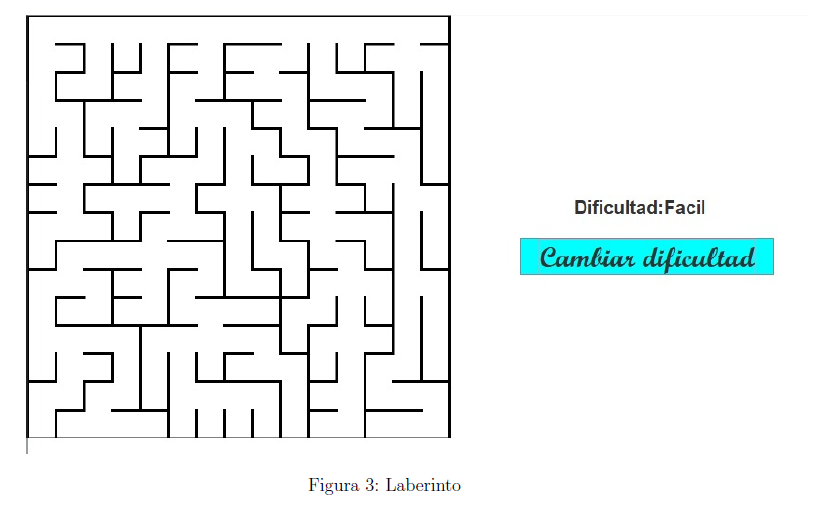
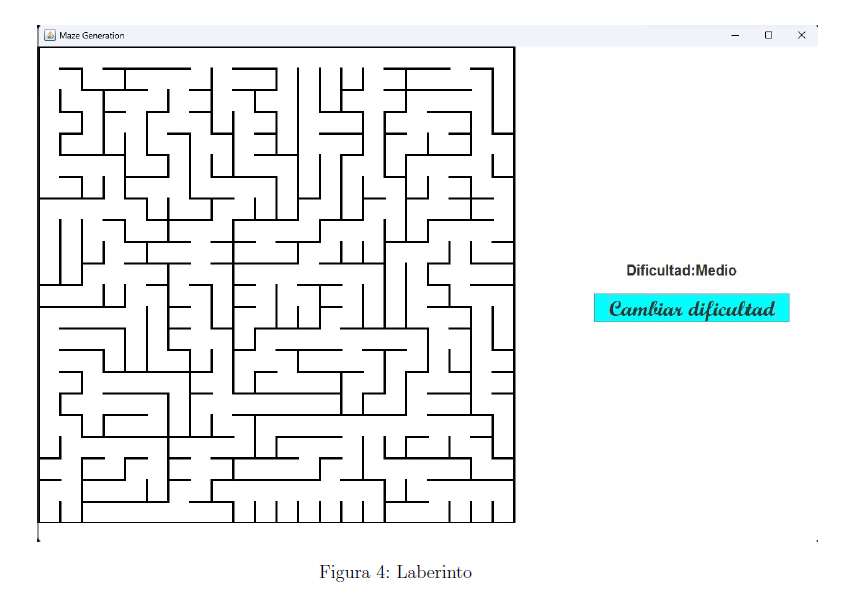
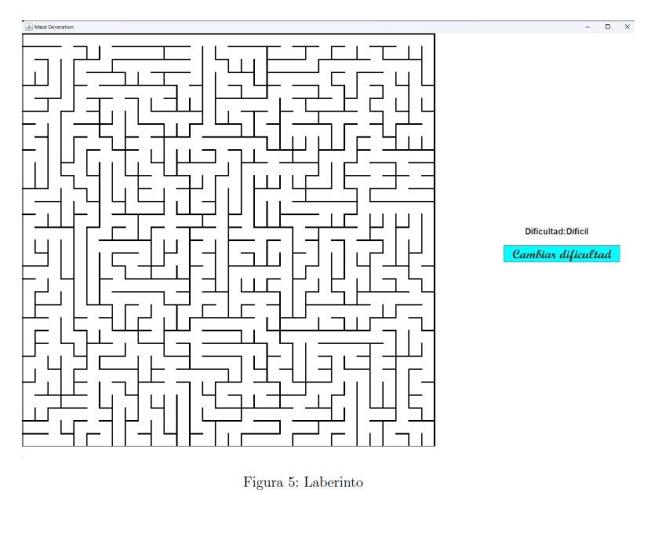

# Proyecto de Grafos: Generador de Laberintos

Este proyecto consiste en el desarrollo de un **generador de laberintos basado en grafos**, con interfaz gráfica construida en Java utilizando Swing. Se generan laberintos de tamaño `n x n` con tres niveles de dificultad (fácil, normal, difícil), y se visualizan en tiempo real.

## 📌 Descripción

El objetivo es crear un juego tipo laberinto que ponga a prueba la capacidad de resolución del jugador. Para esto se usa un enfoque algorítmico basado en **grafos y retroceso recursivo (backtracking)**. El proyecto fue desarrollado como parte del curso **Estructura de Datos y Análisis de Algoritmos** en la Universidad Industrial de Santander (UIS).

### Niveles de dificultad:

* **Fácil**: Laberintos pequeños y simples.
* **Normal**: Laberintos medianos con más complejidad.
* **Difícil**: Laberintos grandes con caminos más complicados.

## 🧠 Estrategia de solución

Se implementa una clase `MazeGeneration` que:

* Representa el panel gráfico del laberinto.
* Utiliza un algoritmo de retroceso recursivo para generar los caminos del laberinto.
* Visualiza la solución y los nodos visitados.
* Integra una interfaz para cambiar la dificultad del laberinto dinámicamente.

Se usan estructuras como:

* Matriz de adyacencia (`GrafoMatrizAdya`)
* Pilas para control de retroceso (`Stack`)
* Matrices booleanas para rastrear visitados y solución (`visited`, `solution`)

## 🛠️ Tecnologías utilizadas

* Java SE 7
* Swing (AWT, JPanel, JFrame, Graphics2D)
* Algoritmos de generación de laberintos (basado en [Wikipedia](https://en.wikipedia.org/wiki/Maze_generation_algorithm) y [GeeksforGeeks](https://www.geeksforgeeks.org/rat-in-a-maze/))

## 📸 Ejemplos gráficos

A continuación, algunos ejemplos de laberintos generados (ver sección "Diagramas" en el PDF):

| Ejemplo 1                  | Ejemplo 2                  | Ejemplo 3                  |
| -------------------------- | -------------------------- | -------------------------- |
|  |  |  |

## 👨‍💻 Autores

* **Jeferson Jair Acevedo Sarmiento**
* **Brayan Yesid Quintero Santander**

